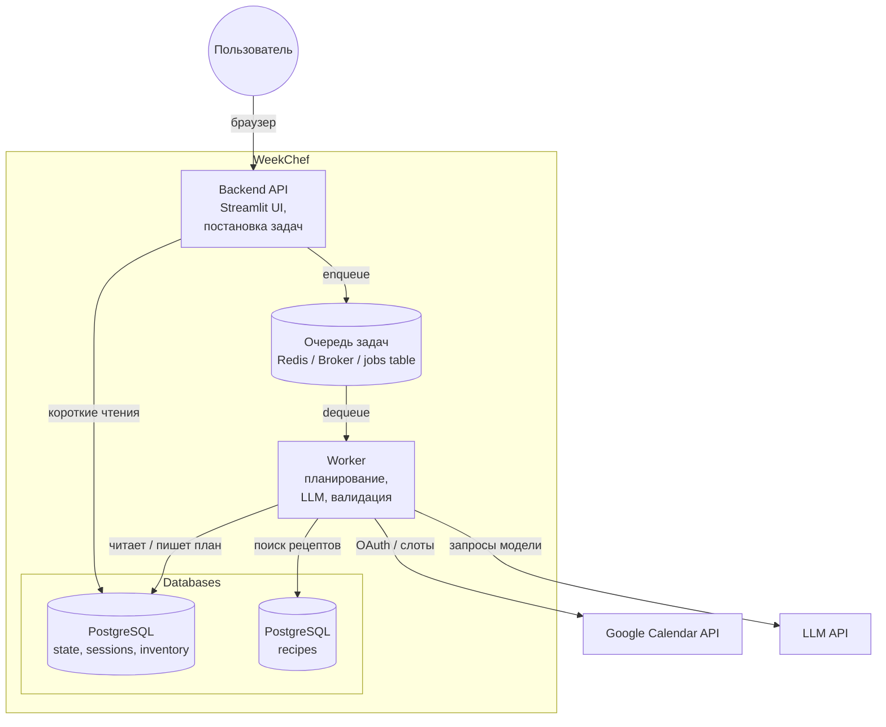

# C4 — Container: WeekChef (Backend + Worker + очередь)

Вариант с отдельным процессом для долгого планирования. **Redis / очередь** — инфраструктура передачи задач (не Worker).

```mermaid
flowchart TB
  User((Пользователь))

  subgraph sys["WeekChef"]
    subgraph db["Databases"]
      PG1[("PostgreSQL\nstate, sessions, inventory")]
      PG2[("PostgreSQL\nrecipes")]
    end
    BE[Backend API\nStreamlit UI,\nпостановка задач]
    W[Worker\nпланирование,\nLLM, валидация]
    Q[("Очередь задач\nRedis / Broker / jobs table")]
    BE -->|enqueue| Q
    Q -->|dequeue| W
    BE -->|короткие чтения| PG1
    W -->|читает / пишет план| PG1
    W -->|поиск рецептов| PG2
  end

  GCal[Google Calendar API]
  LLM[LLM API]

  User -->|браузер| BE

  W -->|OAuth / слоты| GCal
  W -->|запросы модели| LLM
```