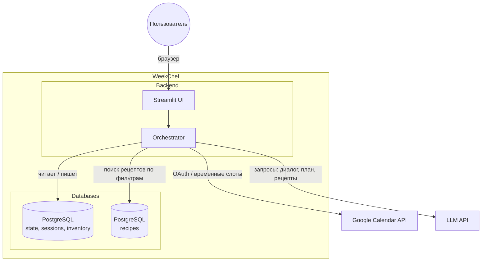

# C4 — Container: WeekChef (синхронный / один процесс Backend)

Граница системы, контейнеры внутри и внешние API. Соответствует схеме со **Streamlit UI**, **Orchestrator** и двумя БД.

```mermaid
flowchart TB
  User((Пользователь))

  subgraph sys["WeekChef"]
    subgraph db["Databases"]
      PG1[("PostgreSQL\nstate, sessions, inventory")]
      PG2[("PostgreSQL\nrecipes")]
    end
    subgraph be["Backend"]
      ST[Streamlit UI]
      OR[Orchestrator]
    end
  end

  GCal[Google Calendar API]
  LLM[LLM API]

  User -->|браузер| ST
  ST --> OR

  OR -->|читает / пишет| PG1
  OR -->|поиск рецептов по фильтрам| PG2
  OR -->|OAuth / временные слоты| GCal
  OR -->|запросы: диалог, план, рецепты| LLM
```