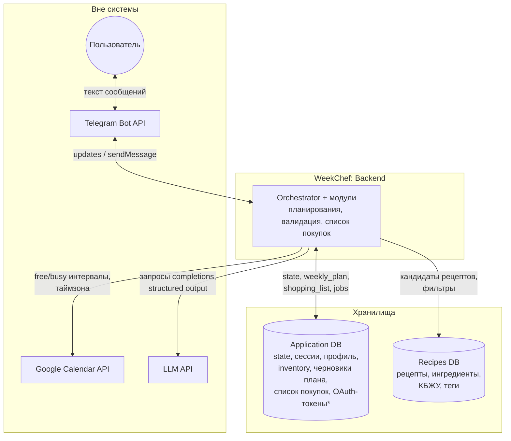
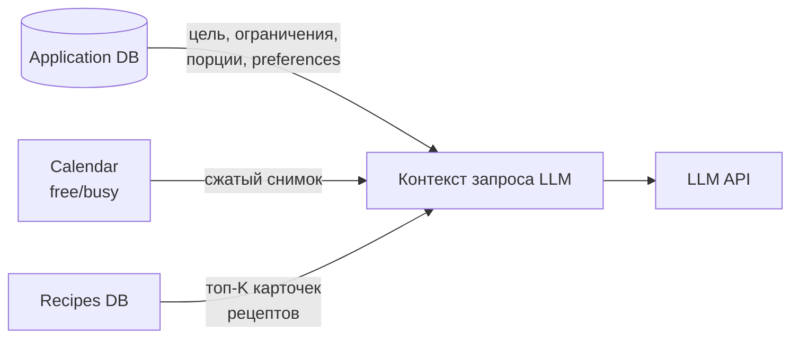
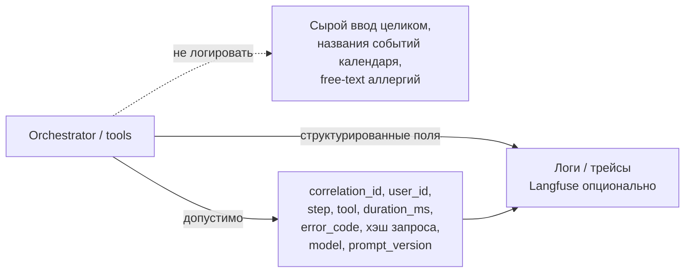

# Data flow diagram — WeekChef

## 1. Основной поток данных (логический)

Пользователь ↔ Telegram; оркестратор тянет внешние API и читает/пишет БД. Стрелки — **данные**, не только вызовы.

\*Токены — в БД или секрет-хранилище по политике деплоя; на схеме показано как «чувствительные данные в защищённом хранилище».

---

## 2. Поток в промпт LLM (контекст)

Кратко: что **собирается в память** для вызова модели (не отдельное хранилище — **снимок** в рантайме).

История чата при переполнении **урезается** (см. `docs/specs/memory-context.md`).

---

## 3. Логирование и наблюдаемость (отдельный «канал»)

Логи и трейсы **не** являются источником правды для плана; это **события** для отладки и метрик. Пунктир — что **запрещено** класть в лог.

---

## 4. Что хранится (сводка)

| Место | Содержимое (по смыслу) | TTL / примечание |
|-------|-------------------------|------------------|
| **Application DB** | Идентификатор пользователя/сессии, цели и ограничения (структурированно), inventory, черновик и итог `weekly_plan`, `shopping_list`, счётчики диалога, статус фоновой задачи (если есть), токены OAuth при хранении в БД | PoC: данные по запросу / TTL см. `governance.md` |
| **Recipes DB** | Рецепты, ингредиенты, время, теги, КБЖУ | Обновление датасета по релизам |
| **Кэш retriever** (если есть) | Результаты поиска по ключу фильтров | ~24 ч, см. `docs/specs/retriever.md` |
| **Очередь** (если есть Worker) | Задачи «построить план» | До обработки / DLQ по политике |

---

## 5. Что логируется и чего избегать

### Допустимо (ориентир)

- `correlation_id`, псевдоним/`user_id`, `step`, имя tool, `duration_ms`, `result`, `error_code`.
- Для LLM: `model`, `prompt_version`, токены (если API отдаёт usage), число ретраев.
- Коды `reason_codes` от Plan Validator, агрегированные метрики (latency, ошибки по типам).

### Запрещено / минимизация

- Полный **сырой текст** сообщения пользователя, **payload** календаря с названиями событий, **сырой текст** аллергий и мед. формулировок.
- Допустим **короткий хэш** запроса для группировки инцидентов.

Подробнее: `docs/governance.md` (политика логов), `docs/specs/observability-evals.md`.

---

## 6. Retention (напоминание PoC)

- Логи: **7–14 дней** (как в `governance.md`).
- Пользовательские данные: по удалению или TTL **~30 дней** для PoC — уточняется в политике продукта.

---

## Как открыть диаграммы

Mermaid preview в IDE или [mermaid.live](https://mermaid.live).
