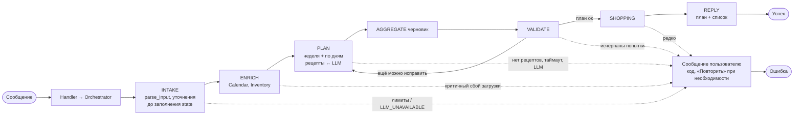
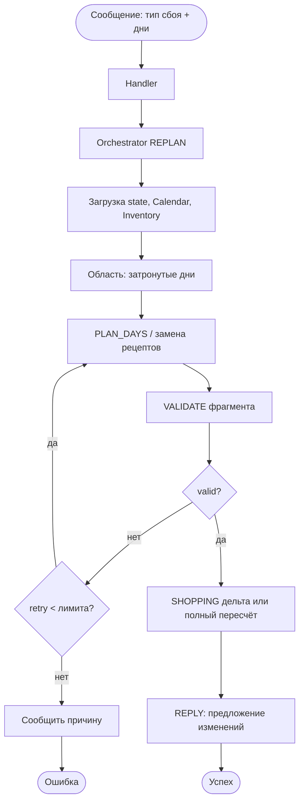

# Workflow / graph: выполнение запроса «план на неделю»

Пошаговый поток оркестратора: **укрупнённая** схема (мало узлов). Детальные ветки и лимиты — в `docs/system-design.md`, `docs/specs/orchestrator.md`.

## 1. Основной сценарий и ошибки

**Что скрыто внутри блоков:**

| Блок | Внутри по сути |
|------|------------------|
| **INTAKE** | Ретраи JSON, до ~5 раундов вопросов, полный отказ LLM → `LLM_UNAVAILABLE`. |
| **ENRICH** | Деградация без полного фона или стоп при критичной ошибке. |
| **PLAN** | `get_recipes`, лимиты вызовов, `PIPELINE_MAX_SECONDS`, ослабление фильтров. |
| **VALIDATE** | До нескольких циклов «перепланировать дни»; исчерпание → объяснение пользователю. |

## 2. Упрощённый поток «перепланирование» (REPLAN)

Вход — новое сообщение после сбоя (нет продукта, сорвалась готовка, смена календаря и т.д.).

